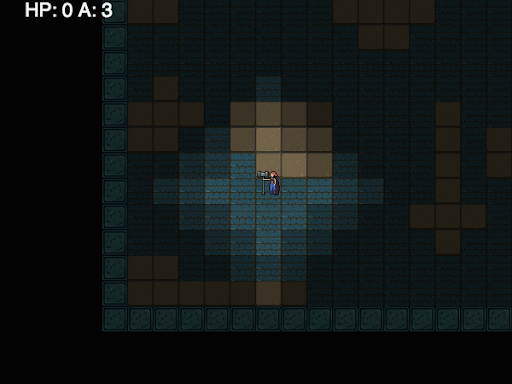
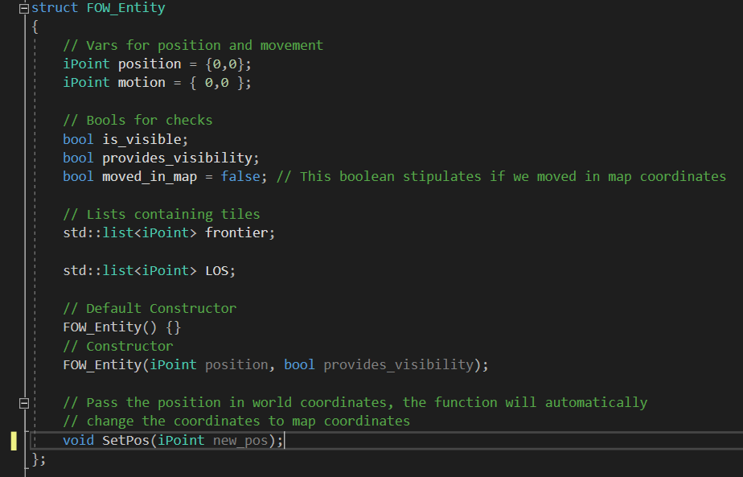
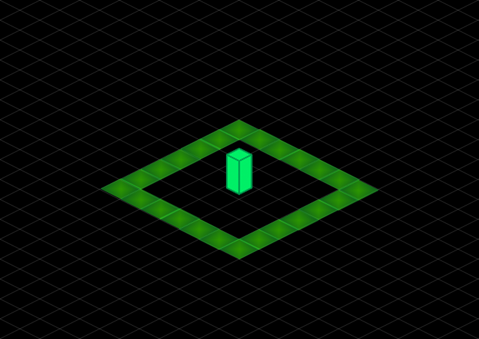
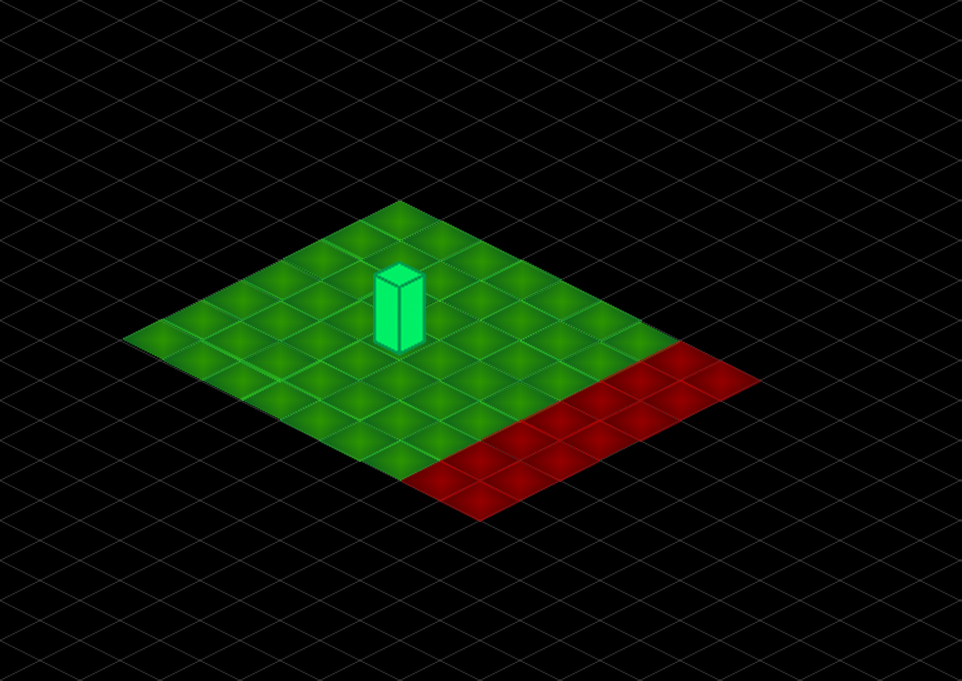

“I am [Dídac Romero](https://www.linkedin.com/in/d%C3%ADdac-romero-cam%C3%B3-203692166/ "LinkedIn"), student of the [Bachelor’s Degree in Video Games by UPC at CITM](https://www.citm.upc.edu/ing/estudis/graus-videojocs/ "Link to the Degree"). This content is generated for the second year’s subject Project 2, under supervision of lecturer [Ricard Pillosu](https://es.linkedin.com/in/ricardpillosu "LinkedIn").”

# What is Fog Of War?
In origin, Fog of War is a term coined and initially used by military officers. Fog of War refers to the uncertainty from difficulty of accurate recognition of your adversaries capabilities, terrain layout and your capabilities to react to the problems that may arise due to this uncertainty.

So in essence, Fog of War is the lack of accurate information regarding a strategic factor you can’t control. 

Since uncertainty can be a very powerful mechanic of a game, specially in strategy games we will now see how the concept of Fog of War is applied to video games both in terms of design and implementation.

# Fog of War in video games

## First appearance

The first time we saw the concept of Fog of War applied in a video game was in the Turn-based Wargame [_Empire_](https://en.wikipedia.org/wiki/Empire_(1977_video_game)) by [_Walter Bright_](https://en.wikipedia.org/wiki/Walter_Bright). In this game black squared tiles covered unvisited areas.


## Classic Fog of War in Strategy Games
[_Warcraft II: Tides of Darkness_](https://en.wikipedia.org/wiki/Warcraft_II:_Tides_of_Darkness) by [_Blizzard Entertainment_](https://www.blizzard.com/en-us/) presents an expansion in the concept of Fog of war in video games by adding a “fogged zone”, in which, if you have scouted that area, you’ll be able to see the map but not the enemies that might be moving or preparing an attack under its cover. 


From that moment on, later strategy games such as _Age of Empires_ or _League of Legends_ to list a few, will implement fogged areas, and these games will let the fogged state reveal information in different ways. For instance, in Age of Empires, you may scout an area where there’s a building, and once you leave the area you still see the building with its life points at the moment of sight. But when you come back the building might have been demolished entirely, and you will only have that information if you re-scout the area with your units. 

## League of Legends
In [_League of Legends_](https://en.wikipedia.org/wiki/League_of_Legends) by [_Riot Games_](https://www.riotgames.com/en) all areas of the map where you don’t have a structure or ally providing visibility are covered in a fog that allow you to see the terrain but not the enemy or neutral entities that are inside the fogged area. But even though you may not have vision of neutral entities like a Drake or the Baron Nashor, which provide great buffs when killed, the game will alert players if these monsters are killed by your opponents. League of Legends is applying the concept of giving information to the players that they shouldn't have in the first place. It seems counterintuitive to implement such a feature for a game in which Fog of War plays a critical role, but that feature may help to avoid delivering a bad gaming experience, since the improvements of these buffs change for a period of time the strategies that both teams will follow and facing the enemy team without that information will more often than not lead to a crushing defeat.

## Innovative ways to use and display Fog of War 
Now we will check some innovative ways that can still be related to the original concepts of completely unvisited and fogged areas.
### Recompile
In the still to be released video game [_Recompile_](https://recompilegame.com/) by [_Phigames_](https://phigames.co.uk/), a new way of revealing the map is explored, in which you “undistort” the world to discover which paths to follow.

Their explanaition on how they achieved this effect [here](https://phigames.co.uk/rcfog.html).


### Cylindrus
[_Cylindrus_](https://shakethatbutton.com/cylindrus/) by [_Jerry Belich_](https://jerrytron.com/) is a game played on a cylinder, creating the effect of “natural fog of war” as described in this [Gamasutra article](http://www.gamasutra.com/view/news/291029/AltCTRLGDC_Showcase_Jerry_Belichs_Cylindrus.php), which forces you to move around the cylinder to see what’s going on.

<iframe width="560" height="315" src="https://www.youtube.com/embed/indWEhAzGac?start=40" frameborder="0" allow="accelerometer; autoplay; encrypted-media; gyroscope; picture-in-picture" allowfullscreen></iframe>

### Ape Out
To mirror [Ape Out](https://www.devolverdigital.com/games/view/ape-out) by [_Bennett Foddy_](https://en.wikipedia.org/wiki/Bennett_Foddy), [_Gabe Cuzzillo_](https://twitter.com/gabecuzzillo?lang=en) and [Matt Boch](https://gamecenter.nyu.edu/faculty/matt-boch/) perspective, we can create the same environment characteristics by combining a 2D map with a technique we will talk about later called 2D visibility, the fog of would help us give a cool perspective to the game.

<iframe width="560" height="315" src="https://www.youtube.com/embed/K7jRL2MtHmU?start=33" frameborder="0" allow="accelerometer; autoplay; encrypted-media; gyroscope; picture-in-picture" allowfullscreen></iframe>

--- 
# Technical approaches
We have seen now which aspects are comprised in the use of Fog of War mechanics and design. Now we will look into how we can implement this features and how the different ways to implement fog of war will help us execute the design we have in mind for our Fog of War mechanics.

## Tile based approach
Some games maps, specially 2D games, are made up of tiles which can have different shapes: orthogonal squared tiles, isometric rectangle tiles or hexagonal tiles. Note that you can still apply this approach to a game with different characteristics in terms of the map, but it will need a way to abstractly partition the terrain that more often than not will make it harder to implement this method.


<p align="center">
	Extracted photo form the article Making a game in less than 13kb, referenced at the end of the web
</p>
In this approach, we will keep track of all the tiles in the map, to know what must be done at each tile in terms of visuals and logic, specially regarding entities such as enemies or structures.

There are a couple of ways to do this, but generally we have a 2D container with the same size as our map. In the container, we will store **ID**’s referring to the state of each tile in its correspondent position, to know if it’s **unvisited**, covered in **fog** or completely **visible**. With this approach we can also have metadata stored in another equal in size 2D container in order to create zones with special conditions, such as always visible areas, areas only visible for certain entities, bushes that hide everything under them until you are inside the bush etc.

The main drawback of this approach is that as tiles have edges, we will need to think and code a solution to smooth the edges of the tiles.

## Mask based approach
In this approach we will draw a surface overlapping the map. This way we cover the map in a determined color and alpha that we want.

 

We will create a png sprite with the shape and radius that we want. This sprite will be following our player. Each time that our character moves, we will be subtracting the transparent area of the sprite we created onto the surface that is covering the map.

 

We can create another gray layer with some transparency that will go under the main black mask of the Fog of war, where we refill the previous “hole” of subtracted pixels before subtracting the sprite onto the surface.


If you want to implement this method into your code, you can check [this link](https://stackoverflow.com/questions/13654753/sdl-drawing-negative-circles-fog-of-war=) where the method is explained in detail and coded in Simple Direct-Media Layer. I also took the photos of this implementation from this explanation.

## 2D visibility approach
This approach is typically used in 2D Top-Down View games and it simulates vision depending on the position of our character and the walls that surround him/her. Please note that images and information were taken both from [Red Blob Games 2D Visibility article](https://www.redblobgames.com/articles/visibility/) and from [this video](https://www.youtube.com/watch?v=fc3nnG2CG8U) by [One Lone Coder](http://onelonecoder.com/).


As I've said before, in this approach we will determine which parts are visible and which are not visible depending on our player's position and the walls/environment surrounding it. The first approach for this, would be to raycast from the center of the player, which will give us an aproximation on how 2D visibility looks like. Like in the previous approach, we print a dark layer overlapping the map. Then, we get the triangles that are formed in-between the rays, and we subtract them to the dark layer.


But that is not efficient, so we should look for a more lighweight and intelligent way to determine the beginning and ending of the walls. This way we can raycast directly to them to generate the triangular shapes that are visible. In the case of the image, the triangles are filled in yellow.


But there's a problem to that: if our map is tile based, or several squares are "joint", we are checking each corner of each tile/square, so we need a way to abstractly represent our map from this.


To this.


So that we perform the least amount of calculations. In this video by One Lone Coder, the implementation of 2D visibility and the abstraction of the map is explained and coded in detail.
<iframe width="560" height="315" src="https://www.youtube.com/embed/fc3nnG2CG8U" frameborder="0" allow="accelerometer; autoplay; encrypted-media; gyroscope; picture-in-picture" allowfullscreen></iframe>

# Implementation: A take on tile based fog of war

Now we will cover in-depth a way to approach the Tile-based fog of war, which is the one that we will be implementing over in the code exercise and that you can check all the code in the repository.

First of all, we need a tile based map, in this case, the map is done in [Tiled](https://www.mapeditor.org/). If you don’t know how to generate and print a tile based map, check this [link](http://www.cplusplus.com/forum/general/18315/). Now that we have a tile-based map, we have to create a 2D Container with the same dimensions as the map. This container will have an ID for each tile of the map, this ID will dictate what’s its state is in relation to Fog of War.

## Pillars of the Implementation:

* **2D Container: Visibility map**

This is a container located in the FOW module. It contains the ID’s for each tile of the map, which dictaminate what is going on with the Fog of War in that tile, allowing us to manipulate the map visibility and hide enemies. To get started we will only have the following ID’s:  0= Unvisited (completely black), 1= Clear (visible) and 2= Fogged (a tile we have cleared but that is no longer on our Line of Sight). 

* **Smoothing the Tiles: generating Fog of War Tiles**

As we will see during the implementation, in order to smooth the tiles we will need to create a spritesheet with the smooth tiles that will be printed over the map. This also means that we will need to have a bigger variety of ID’s available to be used in the visibility map, so we will be using an enum.

* **Regarding Entities**

We will need some sort of abstraction of the entities you have in your game where you plan to implement FOW. This abstraction will need to have a position, a value to detremine if its visible and lists for the frontier and the line of sight (LOS). This entity will be managed by our Fog of war module. But even though, your entities of the game should be able to tell the fog of war manager to create such entity and keep a pointer to it. This way the fog of war module doesn't have to query into other modules, instead your entities will set the position of these FOW entities and receive if they should be visble or not. Note that your entities should have a variable like ``bool im_visible`` which determines if they will be printed or not.
This is the entity abstraction i've created for the exercise we will be coding later.


## Understanding the Algorithm
Let’s start from the point in which we already have a map created and some entities spawned!

### Selecting the Tiles to Update
We have said that we will be setting the values of the visibility map but, how are we going to determine which tiles must be modified or set?

**1. Getting a Frontier**

To do so, entities that will modify the visibility map will have a frontier, which will contain the tiles at maximum sight range from the position of the entity. The frontier must be a set of enclosed tiles! In this case we will be using a rectangle but any enclosed frontier should work too. 




**2. Getting the Line of Sight (LOS)**

Once we have the frontier of that entity we need to fill its LOS (line of sight). Filling all the tiles inside the frontier (including the frontier tiles) will give us the LOS.
The LOS is the area that the entity can see, and those tiles are the ones that will be modifying the ID’s in the visibility map!

")

**3. Updating the visibility map**

Once the entity moves from one tile to another we have to update our Line of Sight area along with the entity. Now we can update the tiles inside the LOS area in the visibility map. We also have to keep track of the tiles that were in our LOS before moving to a new tile. Those tiles then should modify it’s ID’s to the appropriate ID depending on their situation and print an opaque texture over them.




## Mastering the Algorithm: Tile smoothing
As we have seen previously, Tile based fog of war is based on tiles, meaning the edges of the limit of the fog will be rough. To solve that we need to create some textures in the form of a spritesheet, so we can have tiles with some alpha values printed over the limit of our Line of Sight and of our Fog. We will also need a good way to directly print the adequate smoothing tile, so we will need a wider variety of ID’s that can be applied in the visibility map.

The first problem, is updating just the necessary tiles. Moreover, if our system has fogged tiles and unvisited tiles, this means that we will need different smoothing for each of them.


**1. Getting the Tiles to update**

To fix this, we will use the frontier of our entity Following the same strategy that we described before with the Line of Sight. We will be checking the tiles in the frontier to determine which state ID they will have to, after that, print the appropriate texture for the tile.


Now we need to keep the tiles that were contained in the frontier before we moved, to determine which tiles also need updating.


**2. Updating the Tiles new ID’s**
Once we know which tiles must be updated, we need to update their ID’s how do we do that?

To determine which is the state of the tile corresponding to the smoothing tile it needs to print we will be checking its neighbour tiles. By knowing the ID’s of the neighbours in the visibility map, we can know which is the state for the tile we want to update. To do so we should implement a neighbour [aware tile selection algorithm](https://web.archive.org/web/20170608082007/http://www.saltgames.com/article/awareTiles/) to avoid doing very long conditions and switches.

In this algorithm, we check the tiles Above,Left,Below and Right. We can generate a number for each tile by knowing if the tiles: above, at our left, below us, or at our right, have a determined state. For instance, the entity frontier will check if these adjacent tiles have the Fogged state, since it can only be surrounded by them. On the contrary, the tiles that were part of the frontier before we moved, will check if the adjacent tiles are Unvisited to determine the outcome of this algorithm.

So, everytime we visit a neighbour tile we should add a number to a variable. This variable will be the state of the tile, which will dictaminate the smoothing tile that we must print.

**3. Why is this good?**
With this algorithm we use powers of 2 to determine all the outcomes of visiting the tiles, each of them being unique. Pseudocode example of the algorithm here.

```C
 var sum = 0;
 if (above) sum += 1;    // 2 power of 0 = 1
 if (left) sum += 2;     // 2 power of 1 = 2
 if (below) sum += 4;    // 2 power of 2 = 4
 if (right) sum += 8;    // 2 power of 3 = 8
```

# Implementation: Code exercise! Get the algorithm running
To implement the take on tile based fog of war we will follow a series of steps, a series of TODO's to understand and complete a fog of war manager module. Note that some TODO's might require to uncomment certain parts of the code. You can use Ctrl + Shft + F in Visual Studio to search directly each TODO.

Debug Functionalities: **F1** Toggle Fog of war on/off, **1** Toggle Grid on/off, **2** Reset visbility

In case that what to see gifs and solutions are still broken: check them in the original README https://github.com/DidacRomero/Fog-of-War#implementation-code-exercise-get-the-algorithm-running .

### TODO 1
Here we must understand how to get the visibility of a tile from the visibility map inside the FowManager Module. Hint: the function to get the info is called ``GetVisibilityTileAt``
TODO 1 Right now all tiles are being drawn by the Blit below. Check the current  FOW_TileState of x and y map coordinates in the visbility map. Use the 2 variables described before (x and y) in the call of the function. If the tile we are checking is diferent than the UNVISITED FOW_TileState, print it .

```
// TODO 1:Right now all tiles are being drawn by the Blit below.
					// Check the current  FOW_TileState of x and y map coordinates in the visbility map.
					// Use the 2 variables described before (x and y) in the call of the function.
					// If the tile we are checking is diferent than the UNVISITED FOW_TileState, print it .
```

<details> 
  <summary>Solution (click to open)</summary>
  <p> 

</p>
</details>

What you should see:

<p align="center">
  
</p>

### TODO 2
Here we are trying to understand how our own entities will handle the most basic interactions with the Fog of War module. This way, when you include this module into the game you'll understand how to without changing stuff from the Fow Manager your Fog of War module is running in no time! First learn how to tell the FowManager to create a FOW_Entity, and keep track of that entity. Now, we must keep our value for the bool that determines if we are visble in sync with the bool inside the FOW_Entity we have as reference.

```
Inside DummyEnemy
 // TODO 2.1: Create the fow_entity. Essentially we need to tell the FowManager to create a new FOW_Entity*.
	        // our FOW_Entity* fow_entity should be filled with the pointer that the 
	        // function CreateFOWEntity (in the FowManager ) returns.
 
 // TODO 2.2: Update our variable visible, which determines if we will be drawn or not, must be the same as the 
	        // variable is_visible within our fow_entity. The FowManager manages if the fow_entity is visible. Our variable
	        // visible is managed by the EntityManager and determines wheter we will be drawn or not.
 
Inside Player
  // TODO 2.3: Exactly as we did in TODO 2.1, create the fow_entity for the player, keep in mind that
	        // this entity PROVIDES VISIBILITY!!!
 
  // TODO 2.4: Exactly as TODO 2.2 Update our variable visible
```
<details> 
  <summary>Solution (click to open)</summary>
  <p> 


</p>
</details>

What you should see:

<p align="center">
  
</p>
 
 
### TODO 3
The goal of this step is that you apply the concept explained before on how entities can manipulate the visibility map, how they determine which tiles will have their visibility changed in the visibility map, and actually changing them. 

```
Inside  Player
// TODO 3.1: Create 5 tile radius Square frontier, (function named CreateFrontierSquare, inside FowManager) and 
	       // assign it to our fow_entity->frontier. 
	       // Once you have a frontier, fill our Line of Sight Area, fow_entity->LOS, by assigning to it the list
	       // returned by FillFrontier, this function receives a frontier, and returns all tiles inside it including the frontier tiles
// TODO 3.2: Update the fow_entity position, use fow_entity function to SetPos
	       //Our player should update the position of the Fog of war entity that serves as refernce
 
 Inside ManageEntitiesFOWManipulation
 // TODO 3.5 Since we moved we needupdate the position of the tiles in the LOS (Line of Sight), 
				// effectively moving all the LOS area to the current position we are in.
				// Remember that each time an entity moves from one tile to another its variable motion is updated with
				// the total movement in tile distance


	// TODO 3.5 Set The Visibility of the tile we just moved. We need to go to the SAME
				// tile in the VISIBILITY MAP and make it VISIBLE. Look at the header and search which 
				// private function will allow you to do so
```

<details> 
  <summary>Solution (click to open)</summary>
  <p> 


	  
</p>
</details>

What you should see:

<p align="center">
  
</p>

### TODO 4
This TODO is an introduction on how to manage diferent tile states, for now we will manage printing the FOGGED tiles accordingly.

```
// TODO 4: To print over our tiles, since this tileset has decorative parts that get outside
					// the boundaries of the tile we need to re-iterate the tiles and BLIT the FOGGED Rect over
					// the current tile. right above this comment there's a variable called st,that already contains 
					// the state of the tile, use it to compare with desired states.
					// To get the rect to blit our tiles that are diferent than visible, 
					// use the function GetFOWMetaRect from FowManager

					// Remember that the texture of that contains the fog of war tiles it's called meta_FOW and it's inside 
					// the FowManager 
```
Solution

<details> 
  <summary>Solution (click to open)</summary>
  <p> 
	  
</p>
</details>

What you should see:

<p align="center">
  
</p>

### Homework 
### TODO 5
Since we will have to print smoothed tiles we need to manage the visual complexity they bring in. Some smoothed tiles will have to be printed not only over the map tiles like we did previously with FOGGED tiles, some of them will need to print themselves over a FOGGED tile, so we will adress this in this TODO.

```
// TODO 5: You achieved printing a tile over the map, now do it for all states. 
					// EXPAND the code you just wrote in TODO 4 to take into account the following:
					// Since you already receive the TileState and GetFOWMetaRect returns the appropiate rect to blit
					// we only need to manage those tiles that will need to print multiple times over the tile.
					// Like for instance all the UTOF_SMTH TileStates, which need to first print a FOGGED tile, then 
					// their state st over that.
					// UNCOMMENT the parts of the code below and fill in THE BLANKS this all this function must substitute
					// what we did in TODO 4
```

<details> 
  <summary>Solution (click to open)</summary>
  <p> 
	  
</p>
</details>

What you should see:

After uncommenting the part of TODO 6 UNCOMMENT. Some tiles of the meta_FOW spritesheet print in the borders.

<p align="center">
  
</p>

### TODO 6
We're almost there! Right know we need to properly understand how the aware tile selection algorithm works and is applied into our code.
In this TODO we will understand how to identify which tiles will add numbers to our index to determine the right smoothed tile we must be.

```
// TODO 6: UNDERSTAND the Aware tile selection algorithm and how we apply it to choose the smoothing tiles accordingly
		// We already have the diferent checks ABOVE, LEFT, DOWN and RIGHT. You must fill the if(false) statements to properly
		// interpret if the tile state st is "occupying that neighbour tile" and we should add the number to index.
		// Remember that the same contition will be valid for all 4 checks, once you have one, copy-paste the if in the
		// next if(false) statement.
```
<details> 
  <summary>Solution (click to open)</summary>
  <p> 
	  
</p>
</details>

What you should see after uncommenting: Final UNCOMMENT 

<p align="center">
  
</p>


# Improvements on the system
### **Easy:   (Lvl. 1 Student)**
 * **Load metadata from an xml!**
 Create a metadata map in a similar way to the visibility map and fill it with information with Tiled.
 This will allow you to be more creative in design and is necessary for some improvements in this list: Implementing bushes, Entities that interact diferently with the fog of war. 
 * **Vision Buffs and De-buffs**
 A good example would be Warcraft III, in which units have more or less line of sight depending on if it's day or night, or if you buy a   certain improvement for a troop like ultravision.
 * **Entities that interact differently with Fog of War**
 If a flying entity and a ground entity where to be in the same position and we have heights implemented into our RTS, the ground units  shouldn't be able to see the terraing that is above them but flying entities should be able to see the higher ground.
### **Medium:   (Lvl. 50  HackerMan)**
* **Quad Trees**
If your game doesn't use quad trees already, implement them in code for all checks related to blits.
* **Bushes**
 Implement a system of bushes where players and enemies can hide like if it was a Fogged zone. Try to implement it like the cool bush system from League of Legends. Things get specially interesting when you are inside a zone of bushes, but your range of visibility is enough to reach another zone of bushes. You shouldn't be able too see what is happening inside that zone of bushes, plus your code has to be optimal to not loose time. You can ask me about this implementation if you like, since I have figured out a way to get around this problem.
 * **Hexagonal tiles**
 Adapt the module we created to work with hexagonal maps
 
### **Hard:   (Lvl. 100 Pointer Demi-god)**
* **Tile Fading**
When a tile is no longer in our line of sight, slowly fade it out.

* **AI & Pathfinding that accounts for fog of war**
Manage AI pathfinding as if it also had fog of war, much strategy games don't do this since they reveal the whole map to the AI, but it is an interesting matter to look into.

# A big thank you

If you have reached this point... Thank you! It means a lot to me if you check this content and it helped you.
I also wanted to thank all the amazing people who is referrenced below or at some point during the web. If you hadn't shared your knowledge online this would not have been possible!

## References

* **About History:**
  * [History of Fog of War](https://en.wikipedia.org/wiki/Fog_of_war)
* **About Technical Approaches**
  * [Mask based Fog of War (Stackoverflow comment/tutorial)](https://stackoverflow.com/questions/13654753/sdl-drawing-negative-circles-fog-of-war=)
  * [Fog of War by Roger Tello](https://github.com/rogerta97/FogOfWar)
  * [Line Of Sight or Shadow Casting in 2D](https://www.youtube.com/watch?v=fc3nnG2CG8U)
  * [2D Visibility](https://www.redblobgames.com/articles/visibility/)
  * [Making a game in less than 13kb by Ernesto Torres] (https://ehtd.wordpress.com/2014/09/16/making-a-game-in-less-than-13kb-part-2/)
* **Implementation: A take on tile based fog of war**
  * [A Story of Fog and War](https://technology.riotgames.com/news/story-fog-and-war)
  * [Fog of War by Roger Tello](https://github.com/rogerta97/FogOfWar)
  * [Neighbour aware tile selection](https://web.archive.org/web/20170608082007/http://www.saltgames.com/article/awareTiles/)
  


